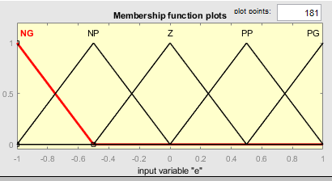
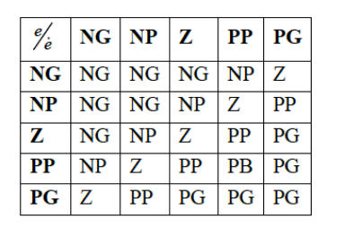

##    Commande de l’inter distance entre deux véhicules


# **Abstract**
Plusieurs solutions sont envisagées pour la réduction des accidents de routes ou la densité de circulation. Ces solutions  vont de la construction de nouvelles autoroutes à l’utilisation de systèmes qui pourront être embarqués dans les véhicules. La construction de nouvelles autoroutes n’est pas une solution envisageable vu les infrastructures urbaines déjà existantes. La meilleure solution s’avère être les dispositifs d’aide au contrôle du véhicule par exemple le contrôle latérale pour éviter de sortir de la voie ou le contrôle longitudinale. Dans ce travail nous utilisons une stratégie de commande longitudinale permettant de maintenir une certaine distance de sécurité entre deux véhicules. L’objectif c’est d’éviter un accident en cas freinage brusque et continu du véhicule maitre. Une approche de modélisation adéquate à notre solution est le modèle du dumper virtuel(ressorts-amortisseurs virtuels) appliquée à la commande par logique flou.

# **Introduction générale**

1. ## **Motivations et Justifications**

On assiste aujourd’hui a une explosion du nombre de voitures. Chaque citoyens veut en posséder une. Les conséquences qui en découlent sont l’augmentation du nombre d’accidents, la pollution et la densité du Traffic. Ce sont les causes de nombreux décès par accidents de routes. Dans le soucis de réduire le nombre de décès par accident de la circulation, les systèmes d’aides à la conduite sont devenus primordiaux. Ces systèmes d’aide à la conduite sont développés sur 03 niveaux :

- **Sécurité passive** :  ces Systèmes ont pour objectif la réduction de l’impact de l’accident sans action préventive. C’est le cas de l’airbag
- **Sécurité active** :Ces systèmes modifient le comportement du véhicule en situation critique sans aucune action d’anticipation. C’est le cas du système ABS, de l’ASR…
- **Sécurité préventive** : systèmes effectuant une action préventive en anticipant les situations dangereuses.

2. ## **Objectif du projet et définition du problème**

Dans un système de convoi, rare sont les conducteurs qui respectent généralement l’inter distance préconisé entre véhicules. Ce qui est très souvent la cause de beaucoup d’accidents lorsque le conducteur d’un véhicule maitre effectue une fausse manœuvre. Nous recherchons ici une solution à la fois intuitive et efficace permettant le maintient d’une certaine distance de sécurité entre les véhicules maitre et esclave. 

L’objectif ici sera donc de mettre en place un algorithme d’inter distance qui sera embarqué dans les véhicules et qui permettra de maintenir ladite distance de sécurité. 

3. ## **Résultat attendu du projet**

Ce qu’on attend de ce projet est qu’en fin de réalisation nous ayons un modèle, un algorithme  d’inter distance robuste, efficace et très optimisé en terme de rapidité et capable d’assurer la fonction qu’on attend de lui.

4. ## **Clients cible**

Le domaine ciblé est bien sur l’industrie automobile par excellence.

## **Application de la logique flou à la commande des systèmes**

Les régulateurs traditionnels sont efficaces pour des systèmes linéaires. Mais face à des systèmes non linéaire ces régulateurs ne sont d’aucunes utilité. Vu la capacité de la logique flou à simuler les décisions humaines, elle est donc plus appropriée à la modélisation des systèmes non linéaires.

Par exemple Une approche très utilisée pour la commande de l’inter distance est le modèle du dumper virtuel. Ce modèle agit comme s’il y’avait des ressorts imaginaires et des amortisseurs entre les véhicules maitre et esclave. Ce type de modèle est à paramètres variables donc non linéaires nous allons donc utiliser la commande par logique flou pour la modélisation d’un tel système.

*Figure 7 : modèle ressort-amortisseurs virtuel*

**Concepts de l’inter distance**

*Figure 8 : paramètres inter distance*

- Xf(t) et xl(t) : positions respectives des véhicules esclaves et maitres
- Vf , Vl : Vitesses respectives des véhicules esclaves et maitres
- dr : 
- ds : distance de sécurité
- dc : distance critique minimale à imposer
- d0 : Inter distance nominale de sécurité

dc, Vmax, Bmax sont des constantes positives

dc et Vmax sont imposées par le conducteur 

Bmax est imposé par les caractéristiques dynamiques du véhicule .

Condition pour éviter un accident : dr >= dc 

Condition de freinage maximale : Vl(t) <= -Bmax

Vitesse maximale initiale à l’instant de franchir la zone jaune : Vl(t) <= Vmax.



# **MODELISATION, SIMULATION ET INTERPRETATION DES RESULTATS**

1. ## **Organigramme des étapes de modélisation**

2) ### **Choix de l’approche de modélisation**

Il s’agit ici de choisir une approche de développement, un modèle à suivre. Nous avons proposé précédemment le modèle ressort-amortisseurs virtuel et c’est ce modèle que nous allons implémenté sous Simulink.

3) ### **Choix de la méthode de développement**

Vu que nous sommes en face d’un systèmes non linéaire nous avons choisi la commande par logique flou pour la modélisation de notre système.

4) ### **Choix des entrées/Sorties**

C’est une étape très importante dans la modélisation du système. 

Le choix des entrées et sorties dépend du type de contrôle que l’on désire réaliser :

- Qu’est-ce-que l’on désire commander ?
- Quels sont les paramètres qui me permettront d’obtenir une telle commande ?

Par la suite il faut définir les univers des discours de ces variables ainsi que leurs subdivisions en sous ensemble flous.

Dans notre cas on choisiras comme entrée de notre système :

- e = erreur entre la distance de sécurité généré par le modèle de référence et la distance réelle entre les deux véhicules mesuréé par un capteur
- de = la dérivée de l’erreur 

  **e[k] = ds[k] - dr[k]**

  **de[k] = e[k] - e[k-1]**

Comme sortie de notre système on prendra la valeur d'accélération ou de freinage sur les actionneurs de traction ou de freinage nommée **du.**

5) ### **Définition des fonctions d’appartenances**

On a choisi ici une fonction d’appartenance de type triangulaire pour chaque variable d’entrée et de sortie.

En tapant fuzzy sur le workspace de Matlab on tombe sur une interface graphique nous permettant de mettre en place rapidement et facilement notre contrôleur flou.

En ce qui concerne la variable d’entrée e on obtient :

*Figure 9 : Fonctions d'appartenances pour e*

Pour la dérivée de l’erreur de :

*Figure 10 : Fonctions d'appartenances pour de*

Pour la sortie du : 

*Figure 11 :  Fonction d'appartenance pour la sortie du*

6) ### **Mise en place des règles du système sous Matlab** 

Les règles définissent le comportement du système. Il faut une certaine expérience dans le domaine pour effectuer une telle tâche car ce travail est fastidieux. Pour notre système voici l’ensemble des règles qui régissent le comportement de notre système :

- NG = Négatif grand
- PG = Positif grand
- NP = Négatif Petit
- PP = Positif Petit
- Z = zéro

*Figure 12 : Base de règles*

![]./markdown_img/(Aspose.Words.4e376920-a7e8-4a1d-9de7-c1b8683feda6.021.png)

*Figure 13: règles du système*

**Nous avons un total de 25 règles**

7) ### **Règles de décision de freinage ou d’accélération**

8) ### **Mise en place du modèle complet sur Simulink**

Le modèle de notre contrôleur flou :

La modélisation complète de notre système :

On a utilisé le model based design pour la modélisation de la voiture et son conducteur. Cette stratégie de modélisation consiste à utiliser un modèle déjà existant et l’adapter à son projet. Le model based design permet un gain de temps énorme et garanti une robustesse du système.

Nous avons mis en place ici un contrôleur flou PID. Puisque la sortie du Contrôleur est une association d’un PI et d’un PD.

**Commande = Fuzzy(e, de) + Fuzzy(∫edt,de)**

La nécessité des gains en sortie du CLF est due au faite que les valeurs fournies par le contrôleur flou sont normalisées entre O et 1.

 ## **Simulation et interprétation des résultats**

Concernant la partie simulation il fallait attribuer un rôle à chaque véhicule. Soit le véhicule est esclave dans ce cas il interagit directement avec le véhicule qui le précède ou bien il est le véhicule maitre dans ce cas il interagit directement avec l’environnement. Selon le rôle affecter à chaque véhicule on distinguera 3 stratégie de commande pour la simulation:

- Stratégie de commande globale(SCG) :On applique une vitesse de consigne au véhicule maitre. Les vitesses des autres véhicules dépendent du maitre
- La Stratégie de Commande Locale(SCL) : C’est une commande de proche en proche utilisée entre seulement deux véhicules qui se suivent. La manière d’appliquer la consigne est identique à la stratégie SCG.
- La stratégie de commande Mixte(SCM) : Même façon d’appliquer la consigne qu’en SCG sauf que le contrôle de l’inter-distance se fait en locale.
